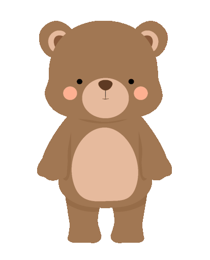

<h1 align="center">Bonjour, Je suis Ambre Andrieux</h1>

  
  

  

## 👨🏻‍💻 A Propos de moi :

- 🙋‍♂️ Tout moi est ici **[Mon site](https://adxmacreation.fr/)**

- 🔭 Je travaille actuellement sur `quelque chose d'intéressant`.

- 🌱 J'apprends actuellement `Symfony`

- 👯 Je cherche un stage en `Développement Web`

- 🤔 Je recherche de l'aide pour apprendre le `C++`

- 👨‍💻 Life Hack : Apprendre de nouvelles technologies et partagez ce que j'ai appris !

  
 
## 🛠️ Technologies et outils que j'utilise :

## ❤️ Contactez moi :

 

